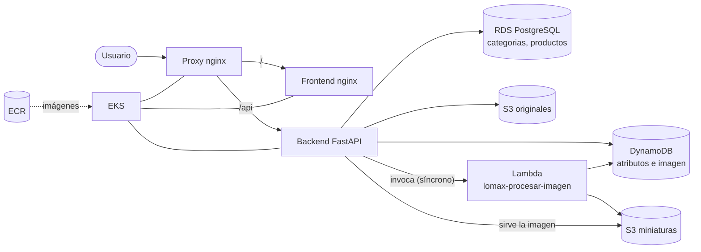

# Lomax SA · Sistema de registro y consulta de productos

Plataforma de catálogo para Lomax SA: cada producto se registra **una sola vez**, con sus
datos fijos, sus atributos variables y su fotografía, y aparece en el catálogo común solo
cuando su información está completa. Todo el entorno AWS corre en local con **Floci**
(emulador de AWS) y la aplicación se despliega en **EKS** con imágenes publicadas en **ECR**.

**Alcance:** registrar productos, mostrar el catálogo y consultar el detalle de un producto.

## Arquitectura



Diagramas de detalle y del flujo de registro: [`docs/arquitectura.md`](docs/arquitectura.md).

| Componente | Tecnología | Nombre en el proyecto |
|---|---|---|
| Frontend | HTML, JS y CSS sobre nginx 1.27 | `lomax-frontend` |
| Reverse proxy | nginx: `/` al frontend, `/api` al backend | `lomax-proxy` |
| Backend | Python 3.12, FastAPI, uvicorn (puerto 8000) | `lomax-backend` |
| RDS | PostgreSQL 15 (`lomax_db`) | `lomax-rds-local` |
| DynamoDB | Tabla con clave `producto_id` (S) | `lomax-productos-attr` |
| S3 | Dos buckets | `lomax-imagenes-originales`, `lomax-imagenes-miniaturas` |
| Lambda | Python 3.12 + Pillow, miniatura de hasta 300×300 | `lomax-procesar-imagen` |
| ECR | Un repositorio por imagen propia | `lomax-backend`, `lomax-frontend`, `lomax-proxy` |
| EKS | Clúster de Floci (nodo k3s), namespace `lomax` | `lomax-eks` |

## Estructura del repositorio

| Ruta | Contenido |
|---|---|
| `backend/` | API (FastAPI) y su `Dockerfile` |
| `frontend/` | Formulario de registro, catálogo con tarjetas y detalle |
| `proxy/` | `nginx.conf` y `Dockerfile` del reverse proxy |
| `lambda/` | Código de la función que valida la imagen y genera la miniatura |
| `db/` | Esquema relacional, datos iniciales y pruebas de restricciones |
| `k8s/` | Manifiestos de Kubernetes y política de confianza del rol EKS |
| `scripts/` | Scripts reproducibles de cada etapa |
| `docs/` | Arquitectura, guía de EKS, índice de evidencias y documentación de errores de la API |
| `evidencia/` | Salidas de terminal y archivos de prueba, una carpeta por etapa (`e3` a `e7`) |
| `docker-compose.yml` | Ejecución local de frontend, backend y proxy |
| `env.example` | Variables de entorno de ejemplo (sin secretos reales) |

Scripts destacados de las etapas finales:

| Script | Función |
|---|---|
| `scripts/eks-hosts.ps1` | Apunta el ConfigMap de EKS a las IP actuales de RDS y Floci en la red `floci-net` y reinicia el backend |
| `scripts/e7_registro.ps1` | Registra un producto por el proxy de EKS, sube su foto y verifica RDS, DynamoDB y S3 |
| `scripts/generar-indice.ps1` | Genera la lista de archivos de evidencia por etapa |

El resto de los scripts de `scripts/` automatiza la carga de datos, las pruebas y las verificaciones de las etapas anteriores.

## Requisitos

- Windows con PowerShell, Docker Desktop y `git`
- AWS CLI v2, Floci CLI, `kubectl`
- Variables de entorno en cada ventana de PowerShell que use `aws`:

```powershell
$env:AWS_ENDPOINT_URL = "http://localhost:4566"
$env:AWS_ACCESS_KEY_ID = "test"
$env:AWS_SECRET_ACCESS_KEY = "test"
$env:AWS_DEFAULT_REGION = "us-east-1"
```

Las credenciales `test/test` son las que exige el emulador; no son credenciales reales de AWS.

## Puesta en marcha

1. Arrancar Floci y comprobar el entorno: `floci start` y `floci doctor`.
2. Crear la infraestructura (RDS, DynamoDB, S3, Lambda) con los scripts de `scripts/` y `db/`.
3. Publicar las imágenes en ECR (los tags usan el hash corto del commit).
4. Ejecutar localmente con `docker compose up -d`, o desplegar en EKS siguiendo
   [`docs/eks.md`](docs/eks.md).

## Verificación de la etapa 7 (EKS)

| Requisito | Resultado |
|---|---|
| EKS ejecuta las imágenes de ECR | El `imageID` de cada Pod coincide con el digest publicado en ECR (`sha256:4f4a709c…`, `a09943d7…`, `e7a416a9…`) |
| Escalar el backend de 1 a 3 réplicas | 3/3 Ready; 60 solicitudes repartidas entre los tres Pods (23, 17 y 20) |
| Eliminar un Pod | UID `0b5d3339…` reemplazado por `2fcf15c2…`; 3/3 recuperado y catálogo operativo |
| Registrar un producto desde EKS | `EKS-E7-001` en RDS, DynamoDB y S3; miniatura de 300×225 |
| Recrear todos los Pods | Los 5 Pods nuevos; el mismo producto sigue `PUBLICADO` con el mismo hash de miniatura (`63618B85…`) |

Detalle y archivos de respaldo: [`docs/indice-evidencias.md`](docs/indice-evidencias.md).

## Decisiones de diseño

- **Un registro, una vez.** El código de producto es único en RDS. Reintentar un registro
  incompleto reutiliza el producto `PENDIENTE` en lugar de crear otro.
- **Sin clave foránea entre servicios.** RDS y DynamoDB comparten el mismo `producto_id`
  (UUID) y la API verifica la consistencia.
- **Publicación condicionada.** Un producto pasa a `PUBLICADO` solo con atributos guardados y
  miniatura disponible.
- **Imágenes a través de la API.** El catálogo usa miniaturas y las sirve la API; no hay URL
  directas a S3.
- **Datos fuera de los Pods.** RDS, DynamoDB y S3 conservan la información cuando se
  recrean los Pods.
- **Etiquetas por commit.** Las imágenes se publican con el hash corto del commit
  (`8154c29`), lo que permite comparar el digest de ECR con el que corre en el clúster.

## Limitaciones conocidas

- **Emulador, no AWS real.** Floci no implementa grupos de nodos de EKS: el clúster es un
  único nodo k3s, así que las tres réplicas comparten nodo.
- **Nombres de contenedor en los Pods.** El DNS del clúster no resuelve los nombres de los
  contenedores de Docker. Por eso `scripts/eks-hosts.ps1` escribe las IP de `floci` y
  `lomax-rds-local` en el ConfigMap. Hay que volver a ejecutarlo si esos contenedores se
  reinician y cambian de IP.
- **Acceso a la aplicación.** En EKS se entra con `kubectl port-forward` al Service `proxy`
  (`http://localhost:8090`), no con un balanceador de carga.
- **Persistencia de Floci.** El estado vive en el volumen de `/app/data`. No ejecutar
  `floci stop`, `docker rm floci` ni `docker volume prune` durante las pruebas.
- **Contraseña por defecto de desarrollo.** `backend/app/config.py` usa `postgres` como valor
  por defecto de `DB_PASSWORD`. En EKS se sobrescribe con el Secret `lomax-db`.

## Seguridad

- `kubeconfig-lomax.yaml` contiene credenciales de administrador del clúster y está en
  `.gitignore`. No debe subirse al repositorio.
- No se versiona ninguna contraseña real: la del Secret de Kubernetes se crea con
  `kubectl` a partir del contenedor de PostgreSQL.
