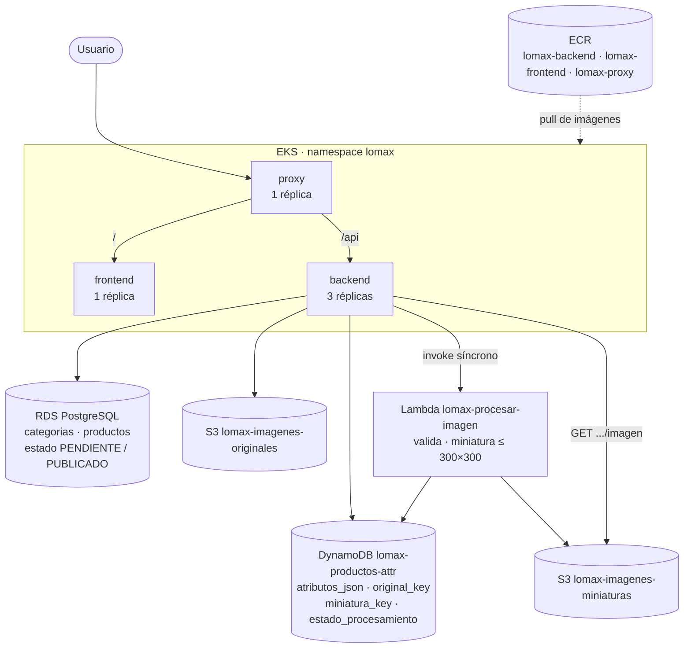
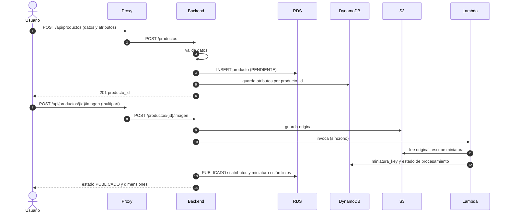

# Arquitectura

## Componentes y datos que guarda cada uno

| Dato | Dónde vive | Por qué |
|---|---|---|
| Código único, nombre, descripción, precio, categoría, fecha, estado | RDS | Integridad relacional: único, obligatorios, precio ≥ 0, categoría existente |
| Atributos variables (conexión y distribución de un teclado; pulgadas y resolución de una pantalla) | DynamoDB | Cada categoría tiene atributos distintos |
| Claves de la imagen original y de la miniatura, estado de procesamiento | DynamoDB | Mismo `producto_id` que RDS |
| Fotografía original y miniatura | S3 (dos buckets) | Las miniaturas aceleran el catálogo |

El `producto_id` (UUID) es el mismo en RDS y DynamoDB. No hay clave foránea entre servicios:
la API comprueba que el identificador exista en ambos lados.

## Flujo de registro

Si algún paso falla, el producto queda `PENDIENTE` y el reintento
(`POST /productos/{id}/reprocesar`, o repetir el registro con el mismo código) no crea otro.

## API

| Método y ruta | Función |
|---|---|
| `GET /categorias` | Lista de categorías |
| `GET /productos` | Catálogo (solo productos publicados) |
| `GET /productos/{pid}` | Detalle con atributos y miniatura |
| `POST /productos` | Registro (JSON: `codigo`, `nombre`, `descripcion`, `precio`, `categoria_id`, `atributos`) |
| `POST /productos/{pid}/imagen` | Subida de la fotografía (campo multipart `file`) |
| `GET /productos/{pid}/imagen` | Miniatura servida por la API |
| `POST /productos/{pid}/reprocesar` | Reintento del procesamiento de imagen |

Errores de la API: [`api-errores.md`](api-errores.md). La documentación interactiva está en
`/api/docs` a través del proxy.

## Despliegue en EKS

| Recurso | Réplicas | Puerto | Notas |
|---|---|---|---|
| `Deployment/backend` | 1 (escalable a 3) | 8000 | Probes en `/docs`; contraseña de la base desde el Secret `lomax-db` |
| `Deployment/frontend` | 1 | 80 | nginx con los archivos estáticos |
| `Deployment/proxy` | 1 | 80 | `/` al Service `frontend`, `/api` al Service `backend` |
| `ConfigMap/lomax-config` | | | Host de RDS, endpoint de Floci, región y credenciales de emulador |
| `Secret/lomax-db` | | | `DB_PASSWORD`, creado con `kubectl`, nunca versionado |

Todas las imágenes salen de ECR con tag igual al commit y se identifican por digest en el
clúster. Guía de despliegue y verificaciones: [`eks.md`](eks.md).
